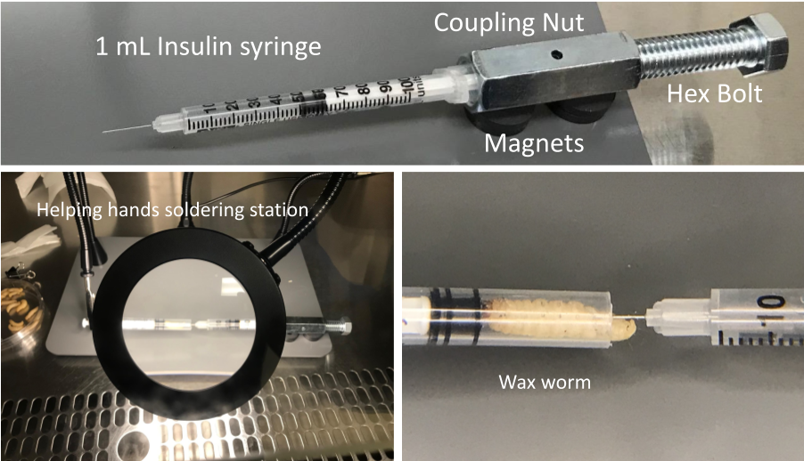

# w.O.R.m
Instructions for constructing and using an apparatus to aid in microbial inoculation experiments of Galleria mellonella (Wax worm)
w.O.R.m = waxworm Operating Room manipulator

## Material List
| Item | cost | link |
| ------------------|-----|-----------------|
| Magnetic Helping Hands | $54.99 | https://www.amazon.com/dp/B09B73XL33 |
| 1cc Insulin Syringe, U-100 29G x 1/2" (EXEL International) | $30.58 /100 syringes | https://www.thomassci.com/Laboratory-Supplies/General-Purpose-Syringes/_/Insulin-Syringes1|
| Ring magnets (Magnet Source .118 in. L X .69 in. W 0.39 lb. pull) |  $5.39 / 6 magnets | https://www.acehardware.com/departments/tools/hand-tools/magnets/2114544 |
| 1/2 inch diameter x 1 inch length hex bolt |    a few dollars   |   found at many hardware stores     | 
| 1/2 inch Coupling nut | a few dollars    | found at many hardware stores     | 

## Setup Instructions

1) Pull back the plunger of one of the 1cc syringes and cut the base of the syringe tube with a razor blade. This syringe will be referred to as the holding syringe.
2) Place one of the magnet alligator clips to one side of the magnet board and secure the plunger of the holding syringe to the alligator clip
3) Place two stacks of two ring magnets on the other side of the magnetic board
4) Obtain another syringe which you will use to inoculate the waxworms. This will be called the inoculating syringe.
5) Fill the inoculating syringe halfway (0.5 mL) with the desired solution for injecting into the waxworms.
6) Carefully insert the plastic barrel extrusion of the syringe into the coupling nut and secure it in place by twisting it several times. The plunger should be inside the coupling nut.
7) Carefully screw the hex bolt into the coupling nut so that it barely touches the end of the plunger of the inoculating syringe. Note: some fluid may be extruded from the needle during this step.
8) Carefully place the coupling nut (which is holding the inoculating syringe on one end and the hex bolt on the other) on the stacks of ring magnets from step 2. Two stacks of two ring magnets were used for this setup.
9) Position the magnetic magnifying glass so that the needle of the inoculating syringe is in the field of view.
10) Place a waxworm in the open end of the holding syringe. You can unclip and then reclip the holding syringe to the alligator clip as needed.
11) Using the flexible arms of the alligator clip, guide the holding syringe with the Wax worm to the needle of the inoculating syringe. The magnifying glass should help with accurate positioning. Once they are aligned you can slowly move the holding syringe so that the needle inserts into the waxworm at its last proleg.
12) Turn the hex bolt on the coupling nut so that an appropriate amount of liquid is injected into the Wax worm. The magnifying glass can be used to determine the volume dispensed by the plunger. Typical experiments call for 10 to 20 uL of liquid which corresponds to two incremental markings on the 100 cc syringe. (1 cc = 1 mL and 1 mL / 100 units = 10 uL)
13) Once the injection is complete, carefully move the waxworm off of the needle using the flexible arm  of the alligator clip as a guide. Use the plunger of the holding syringe to eject the Wax worm from the barrel of the syringe.
14) Continue injecting Wax worms as needed. If the liquid volume on the inoculating syringe gets low, you can carefully disassemble the coupling nut component, refill the syringe, and reassemble the components as in steps 5-8

## Potential Improvements

The hex bolt is manually advanced in this setup. However, this process could perhaps be automated using a stepper motor. The motor could be hooked up to an Arduino that could control the rotation by a button push. The rotation amount could be calibrated to the desired inoculation amount to be dispensed from the syringe (10 -20 uL). Another alternative is connecting a socket wrench to the hex bolt. In this instance, you would only turn the socket component while it is attached to the wrench. As the socket is rotated, it clicks due to the ratchet mechanism. The desired volume to be dispensed could be calibrated to the number of clicks as the socket turns. Both of these advancements would limit the need to look and track the volume being dispensed from the syringe which would help prevent parallax errors.
